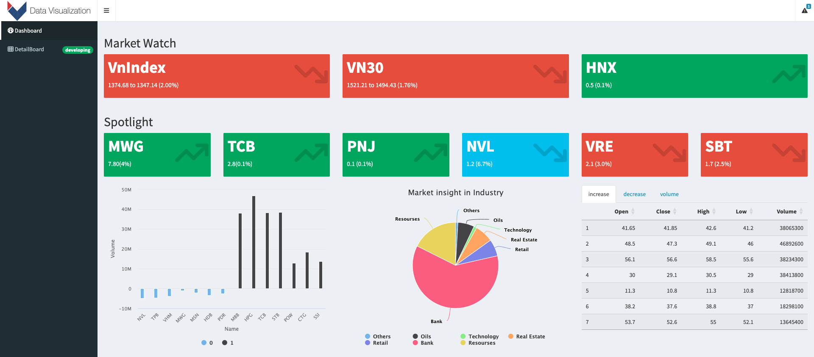
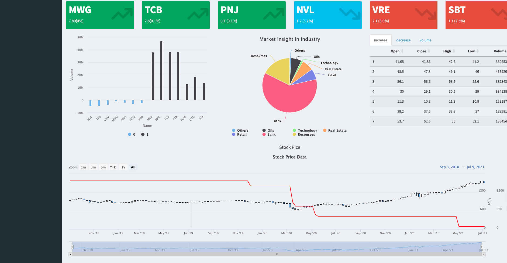
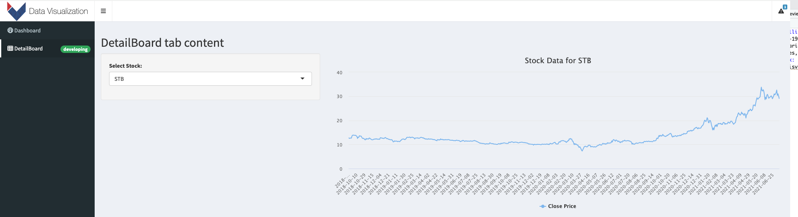

# DataStoryTelling
How the COVID-19 pandemic has affected the Vietnamese stock market. It aims to explore the various dimensions of this impact, including changes in stock prices, trading volumes, ...
## Shinny Link:
https://datavisvinuni.shinyapps.io/datastorytelling/
## Here is some images from dashboards:
### Main:

### VN30 against Vietname interest rate:

### another tab to visualize the specific stock chart:
